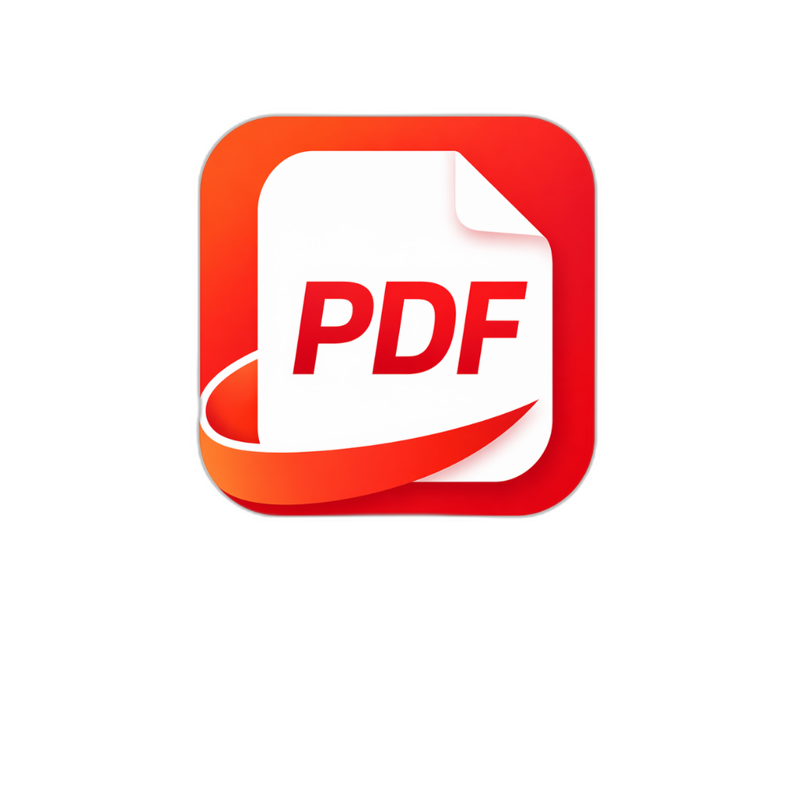

<div align="center">
  
  <h1>全民好用 PDF (PDF Tools Pro)</h1>
  <p><b>本地优先、开源透明的 PDF 桌面生产力工具</b></p>

  <p>
    
    
    
    
  </p>
</div>

---

## 🌟 简介

**全民好用 PDF** 是一款专注于 **本地优先、隐私友好、开源透明** 的现代化桌面 PDF 工具箱。

项目源码开放，用户可以自行编译使用；官方发布的桌面构建提供会员激活、自动更新、批量处理、高级转换等增值能力，用于支持项目持续维护。核心 PDF 文件处理尽量在本机完成，除激活、更新、网页转 PDF 等明确联网功能外，不会上传用户文档。

## 💼 授权与商业模式

- **源码开放**：开发者可按本仓库代码自行编译、研究和二次开发。
- **官方构建**：官方发布的安装包包含会员激活、自动更新和增值功能入口。
- **本地优先**：PDF 合并、拆分、压缩、加密、旋转、水印等核心处理在本机执行。
- **明确联网**：会员激活、检查更新、下载安装包、URL 转 PDF 等功能会访问网络；普通 PDF 文件不会因此上传到云端。

## ✨ 核心特性

- 🔒 **本地优先处理**：常规 PDF 文件处理在本机完成，不上传用户文档。
- ⚡ **无缝系统级集成**：
  - 支持设为 **PDF 默认打开方式**，双击秒开。
  - 自动挂载 Windows 右键菜单：**“在 全民好用PDF 中打开”**。
  - **单例模式护航**，防误触无限多开。
- 🔄 **全能格式互转**：支持 Word / Excel / PPT / TXT / URL 与 PDF 转换（部分能力依赖系统 Office/WPS 或网络）。
- ✂️ **深度页面处理**：自定义多文件自由合并、精准指定页码拆分与提取。
- 🗜️ **极速无损瘦身**：基于底层算法的 PDF 智能压缩，多档位自适应瘦身。
- 🛡️ **安全加解密中心**：提供极其强悍的 **AES-256 级别** PDF 密码锁定与极限解除限制功能。
- 🎨 **现代化次世代 UI**：采用 React + TailwindCSS 构建，原生无边框沉浸式暗黑/亮色搭配设计，丝滑流畅的交互体验。

## 📸 界面预览

*(你可以将软件的截图放到项目中并在这里展示，例如主界面、处理界面等)*

## 🚀 下载与安装

进入本仓库的 **[Releases 页面](../../releases)**，下载最新版的 `pdf-tools-pro-Setup-x.y.z.exe`。
双击安装后，直接享受丝滑体验。

> **注意**：由于本软件为个人开源构建，暂未购买微软的数字签名证书。安装时如遇 Windows Defender 拦截，请点击“更多信息” -> “仍要运行”。

## 🛠️ 技术架构

本项目采用了行业领先的**前后端分离混合架构**：

- **渲染层 (UI)**：`React 19` + `Vite` + `Tailwind CSS`，配合 `lucide-react` 提供精致图标体系。
- **主进程 (Electron)**：处理系统事件拦截、文件关联、更新下载、会员激活、与 Python 引擎的异步 IPC 通讯。
- **核动力引擎 (Python)**：
  - `PyMuPDF (fitz)`：负责所有高强度的 PDF 渲染、压缩、加解密逻辑。
  - `pdf2docx` & `pywin32`：负责 PDF 到 Word 以及 Windows Office/WPS 接口转换。
  - **跨架构脚本引擎**：安装包默认携带 `converter.py` 和依赖清单，不再把 Windows 专用 `converter.exe` 塞进所有构建；Windows 可选使用独立 exe，Linux / ARM64 使用系统 `python3` 执行同一套脚本。

## 💻 本地开发指南

如果您希望参与开发或者自行编译本软件，请按以下步骤操作：

### 环境要求
- Node.js (v18+)
- Python (3.10+)
- Windows Office/WPS 转 PDF：需要本机安装 Microsoft Office 或 WPS。
- Linux / ARM64：需要可用的 `python3`，并安装 `python_engine/requirements.txt` 中的依赖。

### 1. 克隆代码库
```bash
git clone https://github.com/XGxiaoxuezhang/pdf-tools-pro.git
cd pdf-tools-pro
```

### 2. 安装前端依赖
```bash
npm install
```

### 3. 配置后端 Python 引擎
```bash
cd python_engine
pip install -r requirements.txt
```

### 4. 启动开发环境
```bash
# 回到项目根目录
cd ..
# 启动 Vite 热更新服务器与 Electron 窗口
npm run dev
```

### 5. 独立打包发行
```bash
# 当前平台默认构建
npm run build

# Windows x64 / arm64
npm run build:win

# Linux x64 / arm64
npm run build:linux

# 在 Windows 主机上仅做 Linux 解包烟测
npm run build:linux:dir
```
执行完毕后，您可以在 `dist-electron/` 目录中找到安装包。

> 说明：默认构建采用轻量跨平台 Python 脚本引擎。若需要 Windows 免 Python 运行的官方构建，可单独打包 `python_engine/converter.exe` 并作为平台专用资源发布，不建议把它放入 Linux / ARM64 通用包。AppImage/deb 建议在 Linux 或 CI 环境中构建；Windows 主机可用 `build:linux:dir` 验证 x64/arm64 解包结果。

## 🤝 致谢与开源说明

本软件的诞生离不开开源社区的伟大贡献。

**License**: [MIT License](LICENSE)
